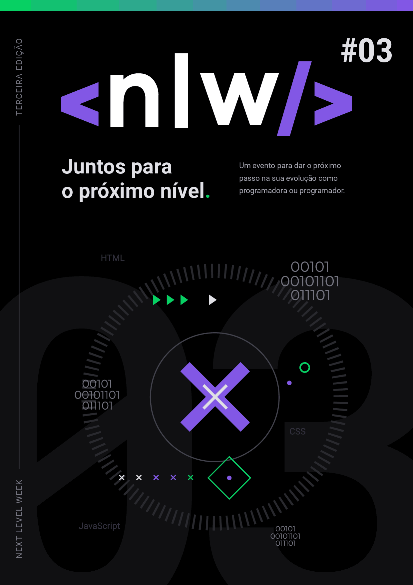

<br />

<h3 align="center">

 </h3>
<h3 align="center">
  Happy | Visite e leve felicidade a diversos lares e orfanatos
</h3>

O layout oficial do Happy pode ser acessado na plataforma **Figma** através [deste link](https://www.figma.com/file/D3j86gLfnDhc3GAIY4MI6z/Happy?node-id=0%3A1)

## 💻 Tecnologias Utilizadas

- 🍏 Express JS - Framework para uso e desenvolvimento de aplicações em JavaScript (Node.js)
- 👺 HandlebarsJS - Template Engine para os tradicionais formatos HTML
- 🍃 Leaflet JS - Framework de aplicação de mapas interativos com JavaScript e OpenStreet Map
- 💽 sqlite3 - Database utilizada para o projeto
- 🥦 NodeJS - Para execução e manutenção do Back-End
- 🌑 Nodemon - Framework do Node para execução do servidor

## ❓ Como Executar

Primeiramente, é necessário ter o [Git](https://git-scm.com/downloads) e o [Node.js](https://nodejs.org/en/download/) instalados no seu sistema. Assim que esses pré-requisitos forem atendidos, basta executar estes comandos, um a um, no seu Terminal ou Shell de preferência:

```
# Clone the repository
git clone https://github.com/Educg550/Happy.git

# Enter in the project folder
cd Happy

# Install dependencies
npm

# Run the project
npm start
```

Assim que o servidor for iniciado, ele será hospedado no seguinte endereço: `127.0.0.1:5500`
<br>
Basta inserir este mesmo endereço no seu navegador e testar a aplicação.

## 🚀 Next Level Week 3


